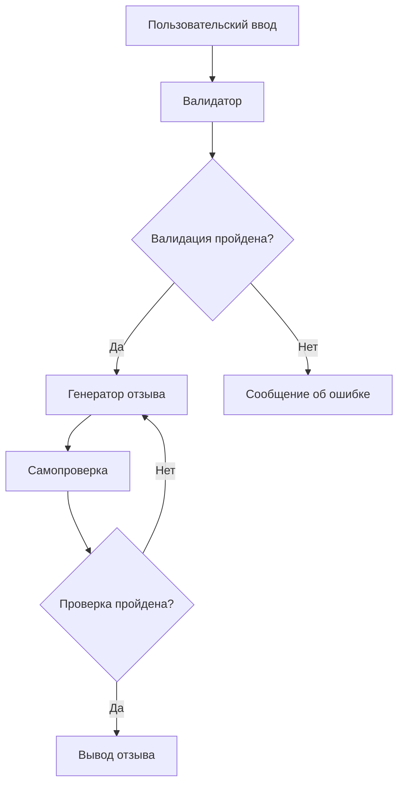

# LLM Integration Documentation

## Архитектура

Интеграция с LLM в нашем приложении построена на основе LangGraph и использует модель `google/gemini-flash-1.5` через OpenRouter API. Процесс обработки запроса проходит через три основных этапа:

1. Валидация входных данных
2. Генерация отзыва
3. Самопроверка сгенерированного отзыва

### Схема работы



## Компоненты системы

### 1. Валидатор входных данных

Проверяет следующие аспекты пользовательского ввода:
- Использование русского языка
- Отсутствие NSFW контента
- Релевантность для генерации отзыва о месте
- Осмысленность текста

#### Примеры проверок

```python
# Валидные входные данные:
"качество обслуживания в ресторане"
"чистота в помещении"
"скорость работы персонала"

# Невалидные входные данные:
"random english text"  # не русский язык
"nsfw content"        # неприемлемый контент
"ываываыва"          # бессмысленный текст
"какая хорошая погода!" # нерелевантно для отзыва о месте
```

### 2. Генератор отзывов

Использует следующие параметры для генерации:
- Ключевая тема отзыва (проверенная валидатором)
- Рейтинг (1-5)
- Рубрика

#### Структура промпта

```python
prompt = f"""
Роль: Опытный составитель отзывов для Яндекс.Карт

Задача: Сгенерировать правдоподобный отзыв о месте ({category}) с рейтингом {rating}/5.
Ключевая тема отзыва: {theme}

Требования к отзыву:
1. Естественность языка и стиля
2. Эмоциональный тон соответствует рейтингу
3. Основной акцент на указанной теме
4. Специфичность для указанной рубрики
5. Длина: 2-4 предложения

Формат отзыва:
- Без приветствий и обращений
- Только текст отзыва
- Без подписей и дат
"""
```

### 3. Система самопроверки

Проверяет сгенерированный отзыв на:
- Соответствие заданной теме
- Соответствие рейтингу
- Естественность языка
- Отсутствие противоречий
- Специфичность для категории

#### Промпт для самопроверки

```python
check_prompt = f"""
Проверь отзыв на соответствие требованиям:

Отзыв: "{generated_review}"
Ожидаемые параметры:
- Тема: {theme}
- Рейтинг: {rating}/5
- Категория: {category}

Критерии проверки:
1. Соответствие теме (0-10)
2. Соответствие рейтингу (0-10)
3. Естественность языка (0-10)
4. Отсутствие противоречий (0-10)
5. Специфичность для категории (0-10)

Формат ответа:
- Оценки по каждому критерию
- Общий вердикт (принять/отклонить)
- Причины отклонения (если есть)
"""
```

## Структура кода

```
src/
  ├── llm/
  │   ├── __init__.py
  │   ├── validator.py    # Валидация входных данных
  │   ├── generator.py    # Генерация отзыва
  │   ├── checker.py      # Самопроверка
  │   └── prompts.py      # Шаблоны промптов
  └── config.py           # Конфигурация LLM
```

## Обработка ошибок

1. Ошибки валидации:
   - Возвращает понятное пользователю сообщение о проблеме
   - Логирует детали для отладки

2. Ошибки генерации:
   - Автоматические повторные попытки (до 3 раз)
   - Fallback на предыдущую успешную генерацию
   - Таймаут 15 секунд на каждую попытку

3. Ошибки самопроверки:
   - Возможность регенерации с учетом выявленных проблем
   - Максимум 2 попытки регенерации

## Метрики и мониторинг

Отслеживаемые метрики:
- Время выполнения каждого этапа
- Процент успешных валидаций
- Процент успешных генераций
- Процент прохождения самопроверки
- Распределение рейтингов и категорий

## Ограничения

1. Модель может иметь предвзятость в определенных темах
2. Возможны задержки при высокой нагрузке
3. Зависимость от доступности OpenRouter API
4. Ограничения на длину входных данных
5. Возможные повторения в генерируемых отзывах

## Дальнейшие улучшения

1. Кэширование популярных запросов
2. Расширение валидационных правил
3. Улучшение промптов для более естественной генерации
4. Добавление тематических шаблонов для разных категорий
5. Интеграция с системой обратной связи для улучшения качества
6. Реализация очереди запросов для высоких нагрузок
7. Добавление механизма rate limiting
8. Расширение системы логирования
